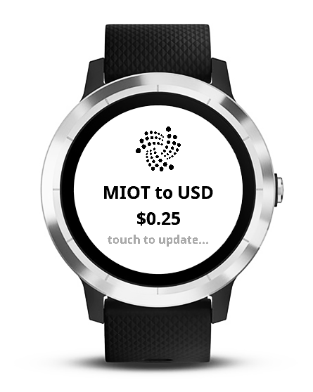

# Garmin-IOTA

:watch: A very simple widget for viewing **(M)[IOTA](https://www.iota.org/)** cryptocurrency to USD rate (using [Cryptonator's API](https://www.cryptonator.com/api)). You can refresh data by just one touch!

  

This is my first app for **[Garmin IQ](https://apps.garmin.com)** platform, that was created for my own needs in order of learning and exploring a *[Monkey C](https://developer.garmin.com/connect-iq/monkey-c/)* programming language. So don't judge:smirk: In the future I plan to add more features.

## Tools needed
- :computer: [Eclipse](https://www.eclipse.org/downloads/)
- :package: [Monkey C SDK](https://developer.garmin.com/connect-iq/sdk/)
- :page_with_curl: [Setting up guide](https://www.programmableweb.com/news/how-to-develop-wearable-apps-connect-iq/sponsored-content/2016/10/11)
- :page_with_curl: [Programmer's guide](https://developer.garmin.com/connect-iq/programmers-guide/)
---
If you preffer :coffee: [IntelliJ IDEA](https://www.jetbrains.com/idea/), you can use (unofficial) [Monkey C plugin](https://plugins.jetbrains.com/plugin/8253-monkey-c-garmin-connect-iq-).
